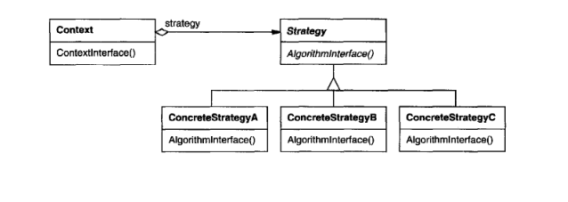

# Strategy Pattern (or Policy)

## Intent

define a family of algorithms, encapsulate each one, and make them interchangeable. 
Strategy lets algorithms vary independently from clients that use them

